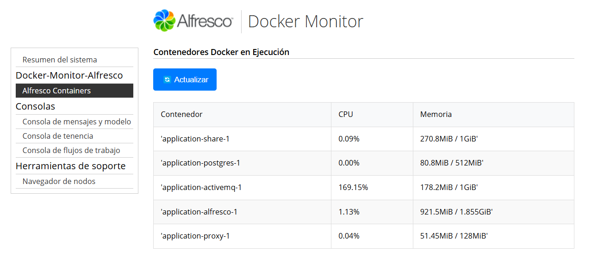

# docker-monitor-alfresco-integrated

Este módulo añade una funcionalidad personalizada a la Consola de Administración de Alfresco, permitiendo monitorear en tiempo real los contenedores Docker que se están ejecutando en el servidor donde Alfresco está desplegado.

🚀 Características

Visualización en tiempo real del consumo de recursos de contenedores Docker.

Información mostrada:
    - Nombre del contenedor
    - Consumo de CPU (% de uso)
    - Uso de memoria (MB/GB)

Botón interactivo para actualizar los datos dinámicamente desde la consola sin necesidad de recargar la página completa.

